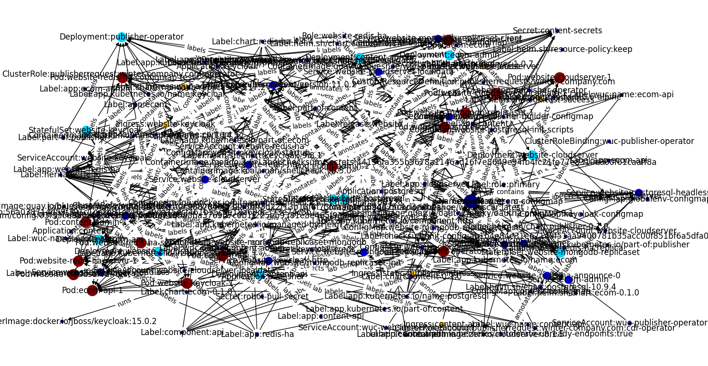

# Caboto
Caboto, the Kubernetes semantic analysis toolkit. It provides a lightweight library for semantically analyse 
plain Kubernetes manifests without running a cluster.  
Internally, Caboto represents all K8s objects in a graph structure based on [NetworkX](https://networkx.org/) which allows following edges and make sense
of the relations between objects.

## Usage
To start with, load plain manifests files into Caboto. Please mind that you will have to generate *Helm chats* into plain Kubernetes
manifests (in yaml format) in order to load them.  
**Hint:** you may render your Helm charts in one yaml file like so:
```bash
helm template my-charts -n my-namespace my-charts/ -f values.yaml > ~/my-manifests/output.yaml
```
Caboto loads multiple yaml documents from one file if they are separated according to the yaml specification.
Please call `caboto.api.create_graph_from_path(path)` which constructs the Caboto graph by recursively loading 
all yaml files from the path. Afterwards discover and represent all supported relations 
with `caboto.api.discover_relations(...)`.  

The idea is to prepare a collection of build-in analysis functions, e.g.
* `list_applications(...)` - returns a list of all applications, and their associated objects
* `list_containerimages(...)` - returns a list of all container images, and the Pods running them
* `list_services(...)` - returns a list of all Kubernetes service objects, and the Pods serving them
A full list of build-in analysis functions can be found in the documentation.
  
## CLI
You can run Caboto as a CLI script using:
```bash
python caboto [ARGUMENTS]
```
For example, you can plot the Caboto graph using [mathplotlib](https://matplotlib.org/) with
`python caboto -p`. If the manifest files are not located in the current working directory please specifiy the
path using the `--manifests/-m` option.
Run an analysis function with the `--run/-r` argument plus the function name, like so 
`python caboto -r list_applications`

The Coboto graph for an average Kubernetes project may look like this:


## Why Caboto?
Caboto is named after Giovanni Caboto, the earliest-known European explorer of coastal North America since the Norse. 
Please read on: https://en.wikipedia.org/wiki/John_Cabot 


